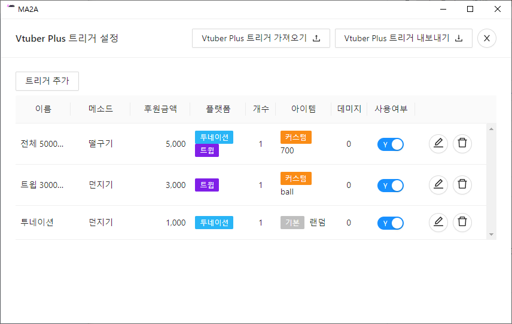

> *주의: 본 프로그램은 재능 기부 형태로 제작되었습니다. 지속적인 관리가 어려운 점 참고 바랍니다.*         
> *이미지 및 테스트 지원: 앙쥬님, 천년낚시꾼님*

# MA2A: Money Attack To Angjyu 

투네이션, 트윕 후원 알림과 Vtuber Plus 연동 프로그램        

- 투네이션 후원 알림 연결 및 수신
- 트윕 후원 알림 연결 및 수신
- Vtuber Plus 연결
- 후원 금액에 따라 Vtuber Plus 던지기(VTP_Throw), 떨구기(VTP_Drop) 동작 관리

> Vtuber Plus 3.5.4 까지 지원

## 주의사항

> 1.1.7 이하 버전 사용 중이신 분은 1.1.7 버전을 사용하시는 경우 VTP(Vtuber Plus) 트리거 내보내기를 하신 후 가져오기를 해주시길 바랍니다.

> 투네이션 자체에서 재연결 시 10초 대기 시간 필요합니다. 모든 후원 연결 재연결 시 10초 이상 알림을 받지 못 할 수 있는 점 참고 바랍니다.

[프로그램 문의 디스코드 채널](https://discord.gg/9TTw7nnhYp)

## 다운로드 및 실행

다운로드 한 후 MA2A.exe를 실행해주시길 바랍니다.

[MA2A 다운로드](https://github.com/baemi/MA2A/releases)

## 사용법

     
설정 화면 예시

### Toonation Alert 설정

투네이션 알림 키 확인: `투네이션 > 크리에이트 로그인 > 위젯 > 알림창 > 기본 위젯 URL` 에서 통합 위젯에 있는 링크 끝에 키(key)를 입력

키 입력 후 연결 버튼 클릭. 연결 성공시 상단에 연결 성공 메시지가 팝업됩니다.

### Twip Alert 설정

트윕 알림 키 확인: `트윕 > 스트리머 로그인 > 알림창 Alert Box` 에서 클릭해서 URL 확인을 통해 표시되는 링크 끝에 키(key)를 입력

키 입력 후 연결 버튼 클릭. 연결 성공시 상단에 연결 성공 메시지가 팝업됩니다.

### Vtuber Plus Websocket Server 설정

Vtuber Plus 설정을 건드리지 않았다면 기본값 그대로 연결이 가능합니다.

Vtuber Plus Websocket Server 설정 확인: `Vtuber Plus 실행 > 로그인 > Settings - General` 에서 하단의 `Websockete Server`의 IP와 Port 확인

### Vtuber Plus 커스텀 아이템 목록 불러오기

`Vtuber Plus` 폴더를 기준으로 `VTuber Plus_data > UserItem`의 경로 입력

예시: `VTuber Plus v3_5_4\VTuber Plus_Data\UserItem`

경로 입력 후 목록 불러오기 버튼을 클릭합니다. 불러오기가 성공 시 상단에 성공 메시지가 팝업됩니다.

 
 

       
Vtuber Plus 트리거 목록 화면 예시

### Vtuber Plus 트리거 목록 설명

- 트리거 추가: 새로운 트리거를 추가할 수 있는 팝업창이 나타납니다.
- 사용 여부: 트리거 사용 여부를 설정합니다.
- 트리거 수정: 해당 트리거를 수정할 수 있는 팝업창이 나타납니다.
- 트리거 삭제: 트리거를 삭제합니다. 삭제한 트리거는 복구 할 수 없습니다.

### Vtuber Plus 트리거 내보내기 / Vtuber Plus 트리거 가져오기

설정된 Vtuber Plus 트리거를 파일로 저장 또는 불러옵니다.

> 주의: 새로 불러온 Vtuber Plus 트리거의 설정과 사용자가 사용 중인 커스텀 아이템이 다른 경우 제대로 동작하지 않을 수 있습니다. 이 경우 `설정 > 목록 불러오기`를 수행 한 후 다시 트리거를 설정해주시길 바랍니다.

       
Vtuber Plus 트리거 설정 화면 예시

### Vtuber Plus 트리거 폼 설명
- 트리거 이름: 트리거 이름입니다. 중복되는 이름은 사용할 수 없습니다.
- 후원 금액: 트리거가 동작할 후원 금액을 입력합니다. 후원 금액과 동일한 경우에만 동작합니다.
- 후원 메시지: 일치 또는 포함을 선택한 경우, 후원 받은 메시지에 조건을 설정할 수 있다.
- 연동 플랫폼: 트리거 동작을 후원 플랫폼에 따라 동작하도록 선택할 수 있습니다.
- 방법: Vtuber Plus에서 제공하는 액션을 선택합니다.
    - 던지기(VTP_Throw)
    - 떨구기(VTP_Drop)
- 개수: 트리거 동작 시 액션에 따라 나오는 아이템의 수를 입력합니다. 떨구기(VTP_Drop)는 1개로 고정됩니다.
- 커스텀 아이템 사용: Vtuber Plus에서 기본적으로 제공되는 아이템 외 사용자가 직접 등록한 아이템을 사용하도록 설정합니다. `설정 > 목록 불러오기`를 수행해야 선택이 가능합니다.
- 아이템(커스텀 아이템): 트리거 동작시 사용할 아이템을 선택합니다.
- 데미지: 데미지를 설정합니다.
- 테스트: 클릭 시 설정한 값으로 VTP에서 트리거 동작을 확인할 수 있습니다.
- 저장: 클릭 시 Vtuber Plus 트리거 목록에 입력한 트리거가 저장됩니다.

## 개발 정보

### 기술 스택

- node v16.13.2
- electron 17.2.0
- electron-builder 22.14.13
- react 17.0.2
- recoil 0.6.1
- websocket 1.0.34
- antd 4.19.3

프로젝트 명령어:

### `npm start`

개발모드로 실행

### `npm run build`

일렉트론 패키징

## 변경 이력

### 2022-04-14

- 투네이션 알림 연결 자주 끊이는 문제 해결
> 투네이션 자체에서 재연결 시 10초 대기 시간 필요합니다. 모든 후원 연결 재연결 시 10초 이상 알림을 받지 못할 수 있는 점 참고 바랍니다.

### 2022-04-10

- Vtuber Plus 트리거 후원 메시지 조건 설정 기능 추가
- 투네이션 미니 후원 연동(투네이션 조건과 동일하게 동작)
- 연결 실패 시, 연결 버튼 로딩이 지속되는 버그 수정
- 트윕 영상 후원에 동작하는 버그 수정
- 전체 UI 변경

### 2022-04-06

- VTP Throw와 Drop 폴더 중 한쪽에 커스텀 모델링 파일이 없는 경우 커스텀 아이템 사용 여부 버튼이 활성화되지 않는 버그 수정

### 2022-04-03

- 트윕 재연결 자주 발생하는 문제 해결

### 2022-04-01

- 투네이션, 트윕 자동 재연결 추가

### 2022-03-31

- 트윕 연동 추가
- 투네이션 룰렛 알림 차단
- 트리거 관리 Vtuber Plus 떨구기(VTP_Drop) 추가
- Vtuber Plus 트리거 목록 가져오기 / 내보내기 추가
- Vtuber Plus Dropitem 목록 불러오기 추가

### 2022-03-30

- 투네이션 연결 하기 / 연결 끊기 추가
- Vtuber Plus 연결 하기 / 연결 끊기 추가

### 2022-03-29

- 프로토타입 개발